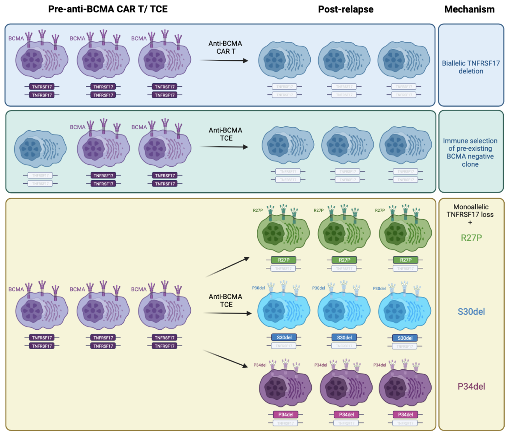

# Welcome
This repository contains analysis scripts for Lee et al. Tumor Intrinsic Mechanisms of Antigen Escape to Anti-BCMA and Anti-GPRC5D Targeted Immunotherapies in Multiple Myeloma. Under review.



# Summary

## Abstract
Multiple myeloma (MM) immune escape resulting from B cell maturation antigen (BCMA) target loss is considered to be a rare event that mediates MM resistance to anti-BCMA chimeric antigen receptor T cell (CAR T) or bispecific T cell engager (TCE) therapies. Emerging clinical data report that downregulation of G protein coupled receptor family C group 5 member D (GPRC5D) protein is observed in patients at relapse post anti-GPRC5D CAR T. The genomic mechanisms that underlie BCMA or GPRC5D loss have not been fully described. In order to examine the tumor intrinsic factors that promote MM antigen escape, we performed combined bulk whole genome sequencing and single cell copy number variation analysis on CD138+ cells from bone marrow aspirates of patients who were treated with anti-BCMA and/ or -GPRC5D CAR T/ TCE (n=25) and patients treated with other MM directed therapies (n=8). We describe five cases with distinct biallelic _TNFRSF17_ mutations  at MM relapse after CAR T/ TCE. BCMA negative clones result from focal biallelic structural deletions at the _TNFRSF17_ locus at relapse or selective expansion of pre-existing subclones with biallelic _TNFRSF17_ loss. Furthermore, we corroborate with functional data that three distinct non-truncating missense mutation (p.R27P) or in-frame deletions (p.S30del and p.P34del)  in the extracellular domain of BCMA negate the efficacies of symmetrical monovalent BCMA directed TCEs mediating clinical relapse. With respect to GPRC5D, we here first report four cases of MM relapse with biallelic mutations of _GPRC5D_ following anti-GPRC5DxCD3ε. Our data support that immunoselection of BCMA negative or mutant clones post anti-BCMA therapies may be more prevalent than currently perceived. Hence, the engineering and selection of immunotherapies in MM should account for targeted antigen structural and extracellular domain mutations that mediate therapy resistance.

# Data

## Single-cell RNA-Seq
NCBI GEO: [GSEXXXXXX](https://www.ncbi.nlm.nih.gov/geo/query/acc.cgi?acc=GSEXXXXXX) <br/>
```
wget https://ftp.ncbi.nlm.nih.gov/geo/series/GSE108nnn/GSEXXXXXX/suppl/GSEXXXXXX_RAW.tar
tar -xvf GSEXXXXXX_RAW.tar
```
NCBI SRA: SRPXXXXXX <br/>
```
source activate sratoolkit
fastq-dump --outdir fastq --gzip --skip-technical  --readids --read-filter pass --dumpbase --split-3 --clip SRR_ID
## Specify SRR_ID - obtained using SRA Run selector.
```

## Single-cell CNV-Seq
NCBI GEO: [GSEXXXXXX](https://www.ncbi.nlm.nih.gov/geo/query/acc.cgi?acc=GSEXXXXXX) <br/>
```
wget https://ftp.ncbi.nlm.nih.gov/geo/series/GSE108nnn/GSEXXXXXX/suppl/GSEXXXXXX_RAW.tar
tar -xvf GSEXXXXXX_RAW.tar
```
NCBI SRA: SRPXXXXXX <br/>
```
source activate sratoolkit
fastq-dump --outdir fastq --gzip --skip-technical  --readids --read-filter pass --dumpbase --split-3 --clip SRR_ID
## Specify SRR_ID - obtained using SRA Run selector.
```

# Contact
Dr. Nizar Bahlis, MD (nbahlis@ucalgary.ca) <br/>
Arnie Charbonneau Cancer Institute, University of Calgary
